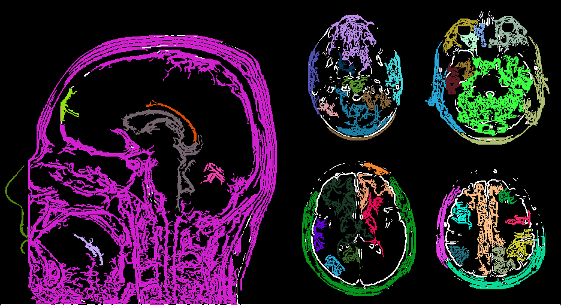

# "Большая задача" -- 2 семестр 1 курс ФКИ 
___

### Компиляция и запуск проекта 

```
    git clone https://github.com/ZhizhchenkoA/BigTask.git
    cd BigTask
    make && ./BigTask
```

### Структура проекта 

```c
    |-img/ // папка с изображениями
     -- ...

    |-src/ // заголовочные файлы
     --components.c // разбиение на компоненты связности
     --filters.c // Фильтры Гаусса и Собеля для изображения
     --image.c // Загрузка/запись изображение
     --stack.c // Работа со стеком для DFS
     --lodepng.c // Библиотека для загрузки изображения
     --main.c // основной код, использование функций из других файлов

    |-include/ // Заголовочные файлы
     --components.h
     --filters.h
     --image.h
     --stack.h 
     --lodepng.h
     --main.h
    |-Makefile // сборка проекта
    |-.gitignore // файлы, которые не надо добавлять в git реозиторий
    |-README.md // информация о проекте 
```

### Подробнее о коде

##### Используемые структуры
 Классический стек с операциями push и pop для реализации нерекурсивного DFS
```c
struct stack_elem{
    int i, j;
    struct stack_elem *next;
};
void push(stack_elem **stack, int i, int j);
stack_elem pop(stack_elem **stack);
```
Структура для хранение одного цветного пикселя в формате RGBA, где каждый цетв представляет собой число типа unsigned char в диапазоне $[0, 255]$

```c
typedef struct pixel {
    unsigned char r, g, b, a;
}pixel;
```

Структура для хранения чёрно-белого пикселя, а также его принадлежности к определённой компоненте свзяности.
```c
typedef struct pixel_wb{
    unsigned char c;
    int component;
}pixel_wb;
```

##### Функции для работы с изображением (из фалйа image.c)

Загрузка изображения и преобрахование его в формат двумерного массива из структур `pixel` размера $\text{height} \times \text{width}$ 
```c
int read_png(struct pixel ***image, int *width, int *height, char *filename);
```

Преобразование изображения в чёрно-белый формат (в двумерный массив структур `pixel_wb`) 
```c
int convert_to_wb(struct pixel **image, int height, int width, struct pixel_wb **image_wb)
```

Вспомогательная функция для копирования чёрно-белого изображения
```с
struct pixel_wb **copy_image_wb(struct pixel_wb **image_wb, int height, int width);
```

Запись чёрно-белого изображения
```с
int write_png_wb(struct pixel_wb **image_wb, int height, int width, char *filename);
```

Раскраска изображения в зависимости от компоненты связности (фон рассматрвается как одна чёрная компонента, мелкие компоненты (с количеством пикселей меньше `min_pixels`) рассматриваются как фон)

```c
int write_png_color(struct pixel_wb **image_wb, int height, int width, int *componets_arr, int min_pixels, char *filename);
```

Цвета генерируются псевдорандомно с помощью умножений номера компоненты связности на простые числа

```c
image[idx] = comp * 13 % 256;
image[idx + 1] = comp * 29 % 256;
image[idx + 2] = comp * 19 % 256;
```

##### Фильтры для изображения (из файла filters.c)

Добавление контрастности (затемненее сильно чёрных пикселей до полностью чёрных, осветление белых до полностью белых, начиная с пороговых значений `min_c` и `max_c` соответственно)

```c
void add_contrast(struct pixel_wb **image_wb, int height, int width, int max_c, int min_c);
```

Фильтр Гуасса для размытия изображения с ядро размера $3 \times 3$ 

$$
    G = \left(\begin{matrix}
    0{,}064 & 0{,}084 & 0{,}064\\
    0{,}084 & 0{,}084 & 0{,}084\\
    0{,}064 & 0{,}084 & 0{,}064
    \end{matrix}\right)
$$

```c
void gaussian_blur(struct pixel_wb **image_wb, int height, int width)
```

Фильр Собеля с ядрами размера $3 \times 3$ для выделения контуров изображения

$$
    G_x = \left(\begin{matrix}
    -1 & 0 & 1\\
    -2 & 0 & 2\\
    -1 & 0 & 1
    \end{matrix}\right)
$$

$$
    G_y = \left(\begin{matrix}
    1 & 2 & 1\\
    0 & 0 & 0\\
    -1 & -2 & -1
    \end{matrix}\right)
$$

```c
void sober_filter(struct pixel_wb **image_wb, int height, int width)
```

##### Работа с изображением, как с графом 

Разбиение графа на компоненты связности путём нерекурсивного DFS. Граф не хранится в явном виде, запускается волна, начиная с левого верхнего угла изображения. Ребро между пикселями есть, если их модуль разницы их цветов не превышает значения ``

```c
void DFS(struct pixel_wb **image_wb, int height, int width, int i, int j, int diff, int idx_component);
int connected_components(struct pixel_wb **image_wb, int height, int width, int diff)
// запуск DFS для каждого пикселя, который ещё не добавлен в какую-либо компоненты
```

Подсчёт количества пикселей в каждой из компонент связности
```c
void count_pixel_in_components(struct pixel_wb **image_wb, int height, int width, int *componets_arr);
```

##### Основной код программы (main.c)

Ведётся последоваетльная обработка изображения 
1) Сначала применяется фильтр Гаусса для размытия изображения.
2) Затем фильтр Собеля для выделения границ.
3) Добавления контрастности.
4) Разбиение на компоненты связности
5) Покраска изображения в зависиомсти от компоненты

### Работа программы на примере
##### ДО:


##### ПОСЛЕ:


